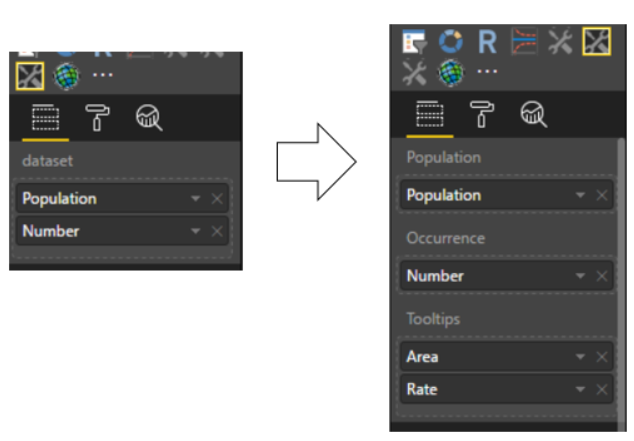
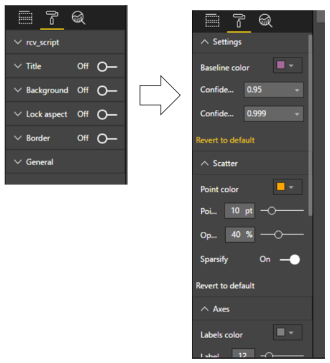
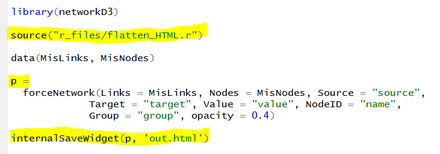

# Tutorial: Funnel Plot from R script to R Custom Visual in Power BI

## Table of Contents
0. [Introduction - Story about the "Funnel Plot"](#chapter-0)
1. [Chapter 1 - Let's start with  R-script](#chapter-1)
2. [Chapter 2 - Let's create R-visual in Power BI](#chapter-2)
3. [Chapter 3 - Package R code in R-powered Custom Visual](#chapter-3)
    1. [Create basic R-powered custom visual](#chapter-31)
    2. [Improve the R-powered custom visual by defining the input fields](#chapter-32)
    3. [Improve the R-powered custom visual by adding user parameters](#chapter-33)
4. [Chapter 4 - Convert our visual from PNG to HTML-based visual](#chapter-4)
    1. [Create HTML-based Custom Visual ](#chapter-41)
    2. [Bonus example with HTML-based Custom Visual](#chapter-42)
5. [Let's summarize about R Custom Visuals](#summary)
6. [Tips and tricks](#tips)
7. [Useful links](#links)


## Story about the "Funnel Plot"<a name="chapter-0"></a>
This [article from The Gaurdian](https://www.theguardian.com/commentisfree/2011/oct/28/bad-science-diy-data-analysis) tells us the inspiring story about how using the wrong visualization tools can 
lead to the wrong conclusion. The real hero of this story is the funnel plot, which can be used for comparing institutional performance and medical data analysis.  


The funnel plot is easy to consume and interpret. The "funnel" is formed by confidence limits and show the amount of expected variation. 
The dots outside the funnel are outliers.

In [this blog ](https://onlinejournalismblog.com/2011/10/31/power-tools-for-aspiring-data-journalists-funnel-plots-in-r/) the author demonstrates the implementation of "funnel plot" in R, and we will use it as a starting point.  


We are going to use this code in order to incrementally create:

1.	R-script for RStudio
1.	R-visual in Power BI
1.	R-powered Custom Visual in Power BI (PNG-based)
1.	R-powered HTML-based Custom Visual in Power BI


## Chapter 1<a name="chapter-1"></a>

The minimal R script and the accompanying data table: 

[chapter1_R\dataset.csv](chapter1_R/dataset.csv)

[chapter1_R\vscript_R_v1_00.r](chapter1_R/script_R_v1_00.r)

The next version of R script is essentially the same, but implements input error handling and user parameters to control the appearance of the plot: 

[chapter1_R\vscript_R_v1_01.r](chapter1_R/script_R_v1_01.r)

All the code is in [chapter1_R](chapter1_R)


## Chapter 2<a name="chapter-2"></a>

Let us load the "dataset.csv" into Power BI desktop workspace as "Cancer Mortality" table. 
The code in ["script_R_v1_01.r"](chapter1_R/script_R_v1_01.r) is almost ready to be used within R-visual. 
We only need to comment out the `read.csv` call.

The resulting R-code is: 

[chapter2_Rvisual\script_RV_v2_00.r](chapter2_Rvisual/script_RV_v2_00.r)

See the result in: 

[chapter2_Rvisual\funnelPlot_Rvisual.pbix](chapter2_Rvisual/funnelPlot_Rvisual.pbix)


__Remark:__ The `dataset` is hard-coded name for the input `data.frame` of any R-visual. 


## Chapter 3<a name="chapter-3"></a>

We are about to package R code in R-powered Custom Visual. 
Before you can get started you'll need to install the PBIVIZ tools. This should not take long.
Follow the [instructions here](https://github.com/Microsoft/PowerBI-visuals/blob/master/tools/README.md#installation)

### Section 3.1<a name="chapter-31"></a>

Now we will use any command line shell (like "Command Prompt") to create new R-powered custom visual:

```
> pbiviz new funnelRvisual -t rvisual
> cd funnelRvisual
> npm install 
> pbiviz package
```

It will create funnelRvisual folder with initial template visual (`-t` stands for _template_). 
The PBIVIZ is in _"dist"_ folder. Try to import it into Power BI and see what it does. The R-code is inside _"script.r"_ file. 

* Open _"script.r"_ file for editing and replace its contents with  ["script_RV_v2_00.r"](chapter2_Rvisual/script_RV_v2_00.r)  just as is!
* Open _"capabilities.json"_ in any editor and Find/Replace the `Values` string by `dataset` string. It replaces the name of "Role" in template to be like in R-code.  See [before vs. after](chapter3_RCustomVisual/funnelRvisual_v01/capabilities_changes.PNG)
* Optionally: open _"dependencies.json"_ in any editor and add one section for each R package required in your R script. This will tell Power BI to automatically import those packages when the visual is loaded for the first time.

Now re-package the visual again: 

`> pbiviz package`

Try to import it into Power BI again and see what it does.  
The resulting PBIX and the whole Custom Visual Project from this section may be found in: 

[chapter3_RCustomVisual/funnelPlot_RCustomVisual.pbix](chapter3_RCustomVisual/funnelPlot_RCustomVisual.pbix)

[chapter3_RCustomVisual\funnelRvisual_v01](chapter3_RCustomVisual/funnelRvisual_v01/)


### Section 3.2<a name="chapter-32"></a>

The Custom Visual in previous section is good to go, but it is not really user-friendly. 
Because user has to know the order of columns in input table.  
Let us divide the input field `dataset` into 3 fields (roles): `Population`, `Number` and `Tooltips`. 




* Edit _"capabilities.json"_ by replacing `dataset` role by three new roles. You will need to update 2 sections: `dataRoles` and `dataViewMappings`

These sections define names, types, tooltips and maximum columns  for each input field. 
See more information [here](https://github.com/Microsoft/PowerBI-visuals/blob/master/Capabilities/Capabilities.md).

The resulting  file is 

[chapter3_RCustomVisual\funnelRvisual_v02\capabilities.json](chapter3_RCustomVisual/funnelRvisual_v02/capabilities.json) 

* Edit _"script.r"_ to support _Population_, _Number_ and _Tooltips_ as input dataframes instead of _dataset_

The resulting  file is 
[chapter3_RCustomVisual\funnelRvisual_v02\script.r](chapter3_RCustomVisual/funnelRvisual_v02/script.r )

To follow the changes in R-script, search for the commented blocks: 

```
#RVIZ_IN_PBI_GUIDE:BEGIN:Added to enable custom visual fields 
...
#RVIZ_IN_PBI_GUIDE:END:Added to enable custom visual fields
```
 
and 

```
#RVIZ_IN_PBI_GUIDE:BEGIN:Removed to enable custom visual fields 
...
#RVIZ_IN_PBI_GUIDE:END:Removed to enable custom visual fields
```

Now re-package the visual again: 

`> pbiviz package`

Try to import it into Power BI again and see what it does.  
The resulting PBIX and the whole Custom Visual Project may be found in:

[chapter3_RCustomVisual](chapter3_RCustomVisual/funnelPlot_RCustomVisual.pbix)

[chapter3_RCustomVisual\funnelRvisual_v02](chapter3_RCustomVisual/funnelRvisual_v02)


### Section 3.3<a name="chapter-33"></a>

The Custom Visual in previous section is almost perfect, but something is still missing. What is it? 
Of course, it is user parameters. 




The user obviously wants to control colors and sizes of visual elements as well as some internal parameters of algorithm from the UI. 
Let's add this capability: 

* We need to edit _"capabilities.json"_ again, this time the _objects_ section. Read more about _objects_ section [here](https://github.com/Microsoft/PowerBI-visuals/blob/master/Capabilities/Objects.md). 

This is the place to define names, tooltips and types of each parameter. We also decide on the partition of parameters into groups (three groups in this case). 


The resulting  file is

[chapter3_RCustomVisual\funnelRvisual_v03\capabilities.json](chapter3_RCustomVisual/funnelRvisual_v03/capabilities.json)

* Now edit the _"src\visual.ts"_ file. 

This file is written in TypeScript.  You may find this part a little confusing, especially if you are not familiar with JavaScript / TypeScript. Don't worry, it is possible to use this example as a template.  

To follow the changes in TypeScript, search for the commented blocks: 

```
//RVIZ_IN_PBI_GUIDE:BEGIN:Added to enable user parameters 
...
//RVIZ_IN_PBI_GUIDE:END:Added to enable user parameters 
```

The resulting  file is 
[chapter3_RCustomVisual\funnelRvisual_v03\src\visual.ts](chapter3_RCustomVisual/funnelRvisual_v03/src/visual.ts)
 

You will find four blocks of code added. 
1. Declare new interface to hold the property value; 
1. Define a member property and default values; 
1. Change the  _updateObjects_  method to get the value of the enumeration; 
1. The code in  _enumerateObjectInstances_ to show the property in the property pane


* Now edit _"script.r"_ to support the parameters in UI, it is quite easy just by adding `if.exists` calls per user-parameter

The resulting  file is:

[chapter3_RCustomVisual\funnelRvisual_v03\script.r](chapter3_RCustomVisual/funnelRvisual_v03/script.r)

To follow the changes in the R script, search for the commented code blocks: 

```
#RVIZ_IN_PBI_GUIDE:BEGIN:Added to enable user parameters
 ...
#RVIZ_IN_PBI_GUIDE:END:Added to enable user parameters 
 ```
 
and 

```
#RVIZ_IN_PBI_GUIDE:BEGIN:Removed to enable user parameters 
 ...
#RVIZ_IN_PBI_GUIDE:END:Removed to enable user parameters
```

Note that you may decide not to expose some of the parameters to UI, like we did.  
 

Now re-package the visual again: 

`> pbiviz package`

Try to import it into Power BI again and see what it does.  
The resulting PBIX and the whole Custom Visual project in this section may be found in:  


[chapter3_RCustomVisual](chapter3_RCustomVisual/funnelPlot_RCustomVisual.pbix)

[chapter3_RCustomVisual\funnelRvisual_v03](chapter3_RCustomVisual/funnelRvisual_v03/)


__Remark:__ In this tutorial we add  parameters of several types (boolean, numeric, string, color) at once. 
If you find it too complicated to follow, please have a look at [this example](https://github.com/Microsoft/PowerBI-visuals/blob/master/RVisualTutorial/PropertiesPane.md), which shows how to add single parameter. 


## Chapter 4<a name="chapter-4"></a>

### Section 4.1<a name="chapter-41"></a>

The resulting visual is PNG-based and therefore not responsive to mouse hover, can not be zoomed in etc., 
In the last step we will show how it can be converted to HTML-based visual. 
We will create an empty R-powered HTML-based Cutom Visual template and then copy some scripts from PNG-based custom visual project. 

Use command line:

```
> pbiviz new funnelRHTMLvisual -t rhtml
> cd funnelRHTMLvisual
> npm install 
> pbiviz package
```

Explore _"capabilities.json"_ and pay attention to `"scriptOutputType": "html"`  line.

Explore _"dependencies.json"_ and pay attention to names of R-packages listed there.

Explore _"script.r"_ and pay attention to its structure. You may open and run it in RStudio. It does not use external input. 
You will find that it creates and saves _"out.html"_ file. The file will have to be self-contained (without external dependencies) and defines graphics inside HTML widget. 

To help `htmlWidgets` users we also provide R-utilities in _"r_files"_ [folder](chapter4_RHTMLCustomVisual/funnelRHTMLvisual_v01/r_files) to help with conversion of `plotly` or `widget` object into self-content HTML. 
Note that this version of R-powered visual supports `source` command (unlike previous types of visuals) and we will use it to make code more readable.   
 
* Replace template  _"capabilities.json"_ by _"capabilities.json"_ from previous step, but obviously keep:  

`"scriptOutputType": "html"`  

The resulting  file is:
[chapter4_RHTMLCustomVisual\funnelRHTMLvisual_v01\capabilities.json](chapter4_RHTMLCustomVisual/funnelRHTMLvisual_v01/capabilities.json)

* Merge  latest version of the _"sript.r"_ file from Chapter 3 with _"script.r"_ from the template.

What are the changes? We use _plotly_ package to convert _ggplot_ object to _plotly_ object. Next we use _htmlWidgets_ package to save it to HTML-file. 

We also move most of utility functions to [_"r_files/utils.r"_](chapter4_RHTMLCustomVisual/funnelRHTMLvisual_v01/r_files/utils.r) and add `generateNiceTooltips` function for cosmetics of _plotly_ object

The resulting  file is 

[chapter4_RHTMLCustomVisual\funnelRHTMLvisual_v01\script.r](chapter4_RHTMLCustomVisual/funnelRHTMLvisual_v01/script.r)


To follow the changes in R-script, search for the blocks: 

```
#RVIZ_IN_PBI_GUIDE:BEGIN:Added to create HTML-based 
 ...
#RVIZ_IN_PBI_GUIDE:BEGIN:Added to create HTML-based
```

and 

```
#RVIZ_IN_PBI_GUIDE:BEGIN:Removed to create HTML-based  
...
#RVIZ_IN_PBI_GUIDE:BEGIN:Removed to create HTML-based
```


* Merge  latest version of the _"dependencies.json"_ file from Chapter 3 with _"dependencies.json"_ from the template, to include new R-package dependencies

The resulting  file is 
[chapter4_RCustomVisual\funnelRHTMLvisual_v01\dependencies.json](chapter4_RHTMLCustomVisual/funnelRHTMLvisual_v01/dependencies.json)

* Change the script _"src/visual.ts"_ in exactly the same way as you did in Chapter 3.3 

 To follow the changes in TypeScript, search for the blocks:
 
```
//RVIZ_IN_PBI_GUIDE:BEGIN:Added to create HTML-based `
 ...
//RVIZ_IN_PBI_GUIDE:BEGIN:Added to create HTML-based `
```

You will find same four blocks of code added (like in Section 3.3). 
The resulting  file is 
[chapter4_RCustomVisual\funnelRHTMLvisual_v01\src\visual.ts](chapter4_RHTMLCustomVisual/funnelRHTMLvisual_v01/visual.ts)

* Now re-package the visual again: 

`> pbiviz package`

Try to import it into Power BI again and see what it does.  
The resulting PBIX and the whole Custom Visual Project may be found in:  

[chapter4_RCustomVisual\funnelRHTMLvisual_v01](chapter4_RHTMLCustomVisual/funnelRHTMLvisual_v01)


### Section 4.2: Bonus example. <a name="chapter-42"></a>

The resulting project in the previous section is bloated relative to the initial template. This is due to the incremental changes we've made during the tutorial. If we start from an empty project, it will be much less bloated. Create an empty project: 

```
> pbiviz new smallRHTML -t rhtml
> cd smallRHTML
> npm install 
> pbiviz package
```


Take code from this [showcase](http://www.htmlwidgets.org/showcase_networkD3.html) and make changes to it. 

The changes for the HTML-based visual are highlighted



Just copy it instead of your template `script.r` and run `pbiviz package`  again.  Now you get this cool visual in your Power BI report!

## Quick Summary of R-powered Custom Visuals <a name="summary"></a>

Let's recap main steps for creation and perfection of R-powered custom visual from scratch:

1. Start with a working R-script
1.	[Install](https://github.com/Microsoft/PowerBI-visuals/blob/master/tools/README.md#installation) all required components: NodeJS and powerbi-visuals-tools 
1.	Create new template custom visual  
1.	Edit the key files:
    1.  Edit _script.r_ and _capabilities.json_ to create basic working custom visual
    1.  Edit _script.r_ and _capabilities.json_ to allow for multiple input fields (if required)
    1.  Edit _script.r_ and _capabilities.json_ and _visual.ts_ to allow user parameters (if required)
    1.  Edit  _dependencies.json_ and _pbiviz.json_ and _icon.png_ as final touches to your custom visual
1.	Package the visual and share it with the community  


## Tips and Tricks <a name="tips"></a>

* We recommend that developers edit	_"pbiviz.json"_ to contain correct metadata (such as _version_, _email_, _name_, _license type_  etc.)

__IMPORTANT:__ the `"guid"` field is an unique identifier for custom visual. You should be creating new project for every different visual, so the GUID will be different for each visual. It will only be the same if you are copying an old project when you create a new visual, which you should not do.  

* Edit [_"assets/icon.png"_](chapter4_RHTMLCustomVisual/funnelRHTMLvisual_v01/assets/icon.png) to create a cool, unique icon for your custom visual.  

* In order to be able to debug your R-code in RStudio with exactly same data as you have in Power BI report, add the following code in the beginning of the R-script (edit `fileRda` variable): 

```
#DEBUG in RStudio
fileRda = "C:/Users/yourUserName/Temp/tempData.Rda"
if(file.exists(dirname(fileRda)))
{
  if(Sys.getenv("RSTUDIO")!="")
    load(file= fileRda)
  else
    save(list = ls(all.names = TRUE), file=fileRda)
}
```

This code saves the environment from Power BI report and loads it in RStudio. 

* You do not need to develop R-powered Custom Visuals from scratch. All the code is available in [_github_](https://github.com/Microsoft?utf8=%E2%9C%93&q=PowerBI&type=&language=). Select the visual which is the most similar to the one you want to develop. Again, you should not be copying the entire project. If you want to reuse the functionality across visuals, copy the core code across into a new project. For example, you can start from the[spline custom visual](https://github.com/Microsoft/PowerBI-visuals-spline).  


* Keep in mind, that each R visual and R Custom Visual applies `unique` operator to the input table. To avoid the identical rows being removed, consider adding an extra input field with a unique ID and just ignore it in R code.   

* If you have Power BI account, you can use Power BI service to develop your [visual on-the-fly](https://github.com/Microsoft/PowerBI-visuals/blob/master/tools/usage.md#running-your-visual) instead of re-packaging it with `pbiviz package` command. 

*  __And finally we recommend developers to submit their R-powered custom visuals to the store. It's a great way to increase your brand recognition and get your work out into the public sphere.__. 


# Useful links: <a name="links"></a>

R-script showcase:
[https://community.powerbi.com/t5/R-Script-Showcase/bd-p/RVisuals](https://community.powerbi.com/t5/R-Script-Showcase/bd-p/RVisuals)

Office Store (gallery):
[https://store.office.com/en-us/appshome.aspx?ui=en-US&rs=en-US&ad=US&clickedfilter=OfficeProductFilter%3aPowerBI&productgroup=PowerBI](https://store.office.com/en-us/appshome.aspx?ui=en-US&rs=en-US&ad=US&clickedfilter=OfficeProductFilter%3aPowerBI&productgroup=PowerBI)

Custom Visuals Documentation:
[https://github.com/Microsoft/PowerBI-visuals](https://github.com/Microsoft/PowerBI-visuals)

Basic tutorial on R-custom visuals:
[https://github.com/Microsoft/PowerBI-visuals/tree/master/RVisualTutorial](https://github.com/Microsoft/PowerBI-visuals/tree/master/RVisualTutorial)


Develop and submit custom visuals to the store:
[https://powerbi.microsoft.com/en-us/documentation/powerbi-developer-office-store/](https://powerbi.microsoft.com/en-us/documentation/powerbi-developer-office-store/)


