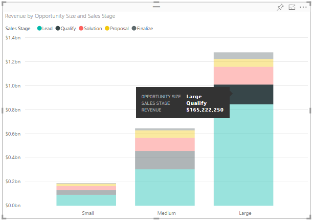

#Handling Visual Selection

Visuals can allow the user to select data points or categories by clicking them with the mouse.

For example, in stacked column chart you can select a particular bar.



Its important to understand that the tooltip is illustrating the three components of this visual's categorical selection id. Category is represented by Opportunity Size = Large, series is represented by Sales Stage = Qualify, and the measure is Revenue. 

##Creating Selection IDs `SelectionIdBuilder`

In order for the visual host to track selected items for your visual and apply cross-filtering to other visuals, you have to generate and store a `SelectionId` for every selectable item. You can use the `SelectionIdBuilder` to generate selection ids.

###Initialize a SelectionIdBuilder

First, you need to create a `SelectionIdBuilder` in your constructor and store it in a private variable in your visual class for later use.

```typescript
class MyVisual implements IVisual {
    
    private selectionIdBuilder: ISelectionIdBuilder;
    
    constructor(options: VisualConstructorOptions) {
        this.selectionIdBuilder = options.host.createSelectionIdBuilder();
    }
}
```

###Generating Selection Ids

```typescript
let dataViews = options.dataViews //options: VisualUpdateOptions
let categorical = dataViews[0].categorical;
let dataValues = categorical.values;

for(let dataValue of dataValues) {
    let values = dataValue.values;
    for(let i = 0, len = dataValue.values.length; i < len; i++) {
        let selectionId = host.createSelectionIdBuilder()
            .withCategory(categorical.categories[0], i)
            .withMeasure(dataValue.source.queryName)
            .withSeries(categorical.values, categorical.values[i])
            .createSelectionId();
    }
}
```

###SelectionIdBuilder Methods
* **withCategory(categoryColumn: DataViewCategoryColumn, index: number)**
    * Tells the builder to use a specific identity under the category provided.
* **withMeasure(measureId: string)**
    * Tells the builder to use the provided string as the measure.
* **withSeries(values: DataViewValueColumns, seriesGroup: DataViewValueColumnGroup)**
    * Your selection ids will include the identity of the given series group. 
    * [See groupings in categorical data mappings for more details](../Capabilities/DataViewMappings.md)
* **createSelectionId()**
    * Creates the selection id with the properties provided.

##Managing Selection `SelectionManager`

You can use `SelectionManager` to notify the visual host of changes in the selection state. 

###Initialize a SelectionManager

First, you need to create a `SelectionManager` in your constructor and store it in a private variable in your visual class for later use.

```typescript
class MyVisual implements IVisual {
    
    private selectionManager: ISelectionManager;
    
    constructor(options: VisualConstructorOptions) {
        this.selectionManager = options.host.createSelectionManager();
    }
}
```

###Setting Selection

**Single selection**

To select an item simply call `select` on the selectionManager passing in the `SelectionId` of the item you want to select. If there are any other items selected the selection manager will automatically deselect them.

The select function returns a promise that will resolve with an array of currently selected ids.

```typescript
this.selectionManager.select(selector).then((ids: ISelectionId[]) => {
    //called when setting the selection has been completed successfully
});
```

**Multiple selection**

To support multi-selection you can provide the optional second parameter with a `true` value. When this is set it will not clear previous selection and just add the new selection to the list of selected ids. 

```typescript
this.selectionManager.select(selector, true).then((ids: ISelectionId[]) => {
    //called when setting the selection has been completed successfully
});
```

**Clearing selection**

To clear selection simply call `clear` on the selection manager. This also retruns a promise that will resolve once the selection is cleared successfully.

```typescript
this.selectionManager.clear().then(() => {
    //called when clearing the selection has been completed successfully
});
```
